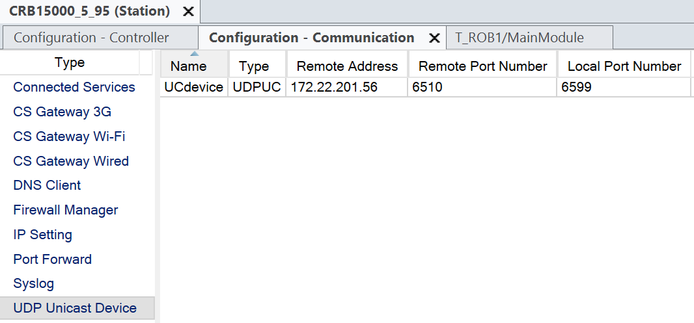

# abb_egm_driver

ROS 2 drivers for ABB robots featuring Externally Guided Motion (EGM) in RobotWare 7.x controllers (OmniCore).

## Installation

Set your ROS 2 environment as usual. Install the following mandatory dependency, then proceed with `colcon build`:

```bashbash
pip install ABBRobotEGM
```

## Usage

The ABB robot can be controlled in the joint or task space by publishing messages to either of the following topics, which should be selected during initialization:

- `command/pose` (geometry_msgs/Pose)
- `command/joint` (std_msgs/Float32MultiArray)
- `command/path_corr` (geometry_msgs/Point)

The [rapid/](rapid) folder contains example RAPID code snippets for both command modes, which can be used as a reference when implementing your own RAPID program. Use [rapid/JointCommander.modx](JointCommander.modx) for joint space control, [rapid/PoseCommander.modx](PoseCommander.modx) for task space control, and [rapid/PathCorrection.modx](PathCorrection.modx) for path correction mode.

Regardless of the command mode, current robot configuration in the joint and tasks spaces is always published on the following topics simultaneously:

- `/state/pose` (geometry_msgs/Pose)
- `/state/joint` (sensor_msgs/JointState)

The following parameters can be set when launching the driver and/or at runtime:

- `egm_port` (int, default: 6510): UDP port number for EGM communication. Make sure it matches the port number configured in RobotStudio. Read only.
- `smooth_factor` (double, default: 0.02): smoothing factor for the low-pass filter (exponential moving average) applied to the commanded trajectory, between 0 and 1. Lower values result in smoother trajectories, but also higher lag.
- `publish_period` (integer, default: 10): period at which the robot state is published, in milliseconds. Zero or negative means the driver will not publish the state. Read only.
- `command_mode` (string, default: "pose"): command mode, either "pose", "joint" or "corr". Read only.

This package also includes a simple keyboard teleoperation node that can be used to test the driver. It publishes commands in the task space, so make sure to launch the driver in pose mode.

### Examples

Joint mode:

```bash
ros2 run abb_egm_driver egm_driver --ros-args -p command_mode:=joint
```

Pose mode:

```bash
ros2 run abb_egm_driver egm_driver --ros-args -p command_mode:=pose
```

Path correction mode:

```bash
ros2 run abb_egm_driver egm_driver --ros-args -p command_mode:=corr
```

All default parameters, and example keyboard-control app:

```bash
ros2 run abb_egm_driver egm_driver --ros-args -p egm_port:=6510 -p smooth_factor:=0.02 -p publish_period:=10 -p command_mode:=pose
ros2 run abb_egm_driver keyboard_teleop
```

## How-To: WSL + EGM

You might need to follow these instructions if you are running the driver in WSL and want to connect it to RobotStudio or a real robot. By default, EGM communication happens over UDP on port 6510, but WSL does not allow incoming connections from the host machine to the WSL instance. Therefore, we need to set up port forwarding to enable communication between RobotStudio and the EGM driver running in WSL.

**Important note:** to avoid conflicts between RobotStudio and the real robot, choose a different EGM port (*Remote Port Number* per the below screenshot) and launch the driver with the `egm_port` parameter set to it:

```bash
ros2 run abb_egm_driver egm_driver --ros-args -p egm_port:=<your_port_number>
```

### Communicate with the real robot

In Windows 11 and WSL 2, it is recommended to enable [mirrored mode networking](https://learn.microsoft.com/en-us/windows/wsl/networking#mirrored-mode-networking). After enabling it, you can follow the same instructions as for RobotStudio, see below (ignore the last step regarding port forwarding).

### Communicate with RobotStudio

In order to communicate WSL with RobotStudio, you might want to enable mirrored mode networking as well and just use the default `127.0.0.1` (localhost) address, but if you prefer to keep the default WSL 2 networking, you can still make it work by setting up port forwarding. To do so, follow these instructions ([SO answer](https://stackoverflow.com/a/68872599)):

1. Launch PowerShell and note down the IP address returned by `$(wsl hostname -I)`. Note there might be multiple addresses, so make sure to pick the one that corresponds to your WSL instance (usually it starts with `172.`).
1. In your RobotStudio project, provided that EGM support has been already enabled, look for *Communication > UDP Unicast Device* in the controller configuration, and fill in the *Remote Address* field of the *UCdevice* entry with the previous IP address. For instance:
   
1. Launch PowerShell with elevated rights and issue the following command:
   ```
   netsh interface portproxy set v4tov4 listenport=6599 listenaddress=0.0.0.0 connectport=6510 connectaddress=$(wsl hostname -I)
   ```

## See also

- [https://github.com/roboticslab-uc3m/jr3_driver](roboticslab-uc3m/jr3_driver)
