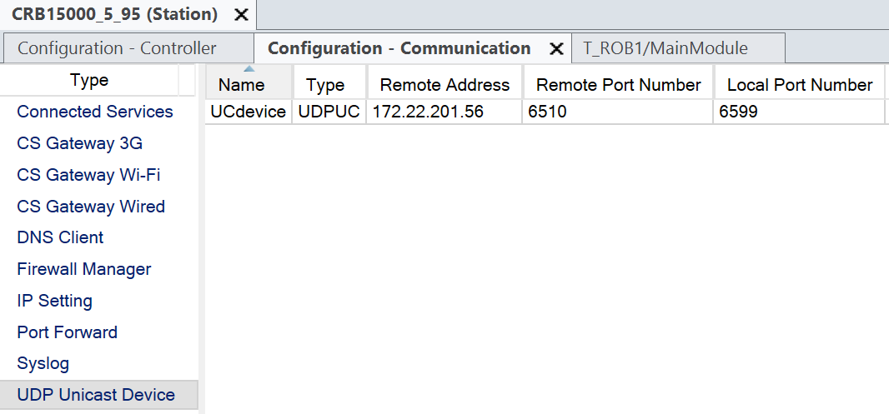

# abb_egm_driver

ROS 2 drivers for ABB robots featuring Externally Guided Motion (EGM) in RobotWare 7.x controllers (OmniCore).

## Installation

Install the following mandatory dependencies:

```bash
pip install ABBRobotEGM PyKDL
```

Then, set your ROS 2 environment as usual. You will also need the [rl_cartesian_control_msgs](https://github.com/roboticslab-uc3m/rl_cartesian_controllers) package. Proceed with `colcon build`.

## Usage

The availability of the following commands depends on the command mode configured on the RAPID side. To comply with it, the same command mode should be selected in the `egm_driver` node during initialization (`command_mode` parameter, as shown in the next sections).

There are three command modes: **joint**, **pose** and **path correction**. The [rapid/](rapid) folder contains example RAPID code snippets for these command modes, which can be used as a template when implementing your own RAPID program. Use [JointCommander.modx](rapid/JointCommander.modx) for joint space control, [PoseCommander.modx](rapid/PoseCommander.modx) for task space control, and [PathCorrection.modx](rapid/PathCorrection.modx) for path correction mode.

Keep in mind that certain commands require that the kinematic chain information has been provided (via `--params-file`) and correctly parsed. For those commands, their respective command mode has been ***italicized***.

### Streaming commands

The ABB robot can be controlled in the joint or task space by publishing high-frequency (up to 250 Hz. i.e., every 4 ms) messages to either of the following topics:

- `/command/pose` (geometry_msgs/Pose, only in **pose** mode)
- `/command/joint` (std_msgs/Float32MultiArray, only in **joint** or ***pose*** modes)
- `/command/path_corr` (geometry_msgs/Point, only in **path correction** mode)
- `/command/data` (std_msgs/Float64MultiArray, only in **pose** mode)

The last command type is available for sending custom data to the robot. In order to use it, a new RAPID array variable must be declared in the global scope (e.g., `PERS dnum in_data{40};`), and then linked to the EGM input through the `\DataFromSensor:=<name>` argument to `EGMActPose` or `EGMActJoint`. On the robot side, you can read the data from that variable and use it as needed in your RAPID code.

### State feedback

Regardless of the command mode, current robot configuration in the joint and tasks spaces is always published simultaneously:

- `/state/pose` (geometry_msgs/PoseStamped)
- `/state/joint` (sensor_msgs/JointState)
- `/state/data` (std_msgs/Float64MultiArray, only in **pose** mode): custom array of 40 double values

The latter topic allows to read any custom data sent from the robot, such as the force/torque measurements from a wrist-mounted sensor, for instance. In order to use it, a new RAPID array variable must be declared in the global scope (e.g., `PERS dnum out_data{40};`), and then linked to the EGM output through the `\DataToSensor:=<name>` argument to `EGMActPose` or `EGMActJoint`. On the driver side, you can read the data from the `/state/data` topic and use it as needed in your ROS 2 application.

### Service commands

Certain low-frequency RPC-like commands have been implemented as services:

- `/actuate_tool` (rl_cartesian_control_msgs/ActuateTool, only in **pose** mode)
- `/stop_control` (std_srvs/Trigger, only in **joint** and **pose** modes)
- `/solve_pose` (rl_cartesian_control_msgs/SolvePose, only in ***joint*** and ***pose*** modes)

The `/actuate_tool` service sets a digital signal on the robot (via `command/do`), which can be used for triggering a tool, for instance. The driver will send a Boolean value together with the joint or pose command, so that they are executed simultaneously on the robot side. In order to use it, a new digital input (DI) signal must be registered in the robot configuration (I/O System > Signal), enabled in RAPID code through the `\DIFromSensor:=<name>` argument to `EGMActPose` or `EGMActJoint`, and then linked to the desired DO (I/O System > Cross Connection, then set the Resultant and Actor 1 properties accordingly).

On the other hand, `/stop_control` halts execution when the action server is processing a new trajectory, and `/solve_pose` performs inverse kinematics on the supploed robot pose (only the nearest joint solution is provided, if any).

### Trajectory execution

The following action servers accepts low-frequency, point-to-point trajectory goals, driven by a velocity profile:

- `/trajectory/joint` (rl_cartesian_control_msgs/JointTrajectory, only in **joint** and ***pose*** modes)
- `/trajectory/pose` (rl_cartesian_control_msgs/PoseTrajectory, only in ***joint*** and **pose** modes)

These actions accept joint and pose goals, respectively; the latter can operate in linear or unrestricted modes, resembling RAPID's MoveL and MoveJ commands, respectively. The `max_lin_velocity`/`max_joint_velocity` and `max_lin_acceleration`/`max_joint_acceleration` parameters can be set to configure the velocity profile of the trajectory (see below for details). Depending on `max_(lin|joint)_acceleration` being used or not, the trajectory will adhere to either a trapezoidal or rectangular velocity profile, respectively.

### Mode compatibility matrix

The following table summarizes the availability of topics, services and actions across all command modes. The ⚠️ icon means that the description of the robot kinematics must be provided on node launch.

<table><thead>
  <tr>
    <th>command mode</th>
    <th>joint</th>
    <th>pose</th>
    <th>path correction</th>
    <th>type</th>
  </tr></thead>
<tbody>
  <tr>
    <td colspan="5" align="center">state feedback (topic publishers)</td>
  </tr>
  <tr>
    <td>/state/pose</td>
    <td align="center">✅</td>
    <td align="center">✅</td>
    <td align="center">✅</td>
    <td>geometry_msgs/PoseStamped</td>
  </tr>
  <tr>
    <td>/state/joint</td>
    <td align="center">✅</td>
    <td align="center">✅</td>
    <td align="center">✅</td>
    <td>sensor_msgs/JointState</td>
  </tr>
  <tr>
    <td>/state/data</td>
    <td align="center">❌</td>
    <td align="center">✅</td>
    <td align="center">❌</td>
    <td>std_msgs/Float64MultiArray</td>
  </tr>
  <tr>
    <td colspan="5" align="center">streaming commands (topic subscriptions)</td>
  </tr>
  <tr>
    <td>/command/pose</td>
    <td align="center">❌</td>
    <td align="center">✅</td>
    <td align="center">❌</td>
    <td>geometry_msgs/Pose</td>
  </tr>
  <tr>
    <td>/command/joint</td>
    <td align="center">✅</td>
    <td align="center">⚠️</td>
    <td align="center">❌</td>
    <td>std_msgs/Float32MultiArray</td>
  </tr>
  <tr>
    <td>/command/path_corr</td>
    <td align="center">❌</td>
    <td align="center">❌</td>
    <td align="center">✅</td>
    <td>geometry_msgs/Point</td>
  </tr>
  <tr>
    <td>/command/data</td>
    <td align="center">❌</td>
    <td align="center">✅</td>
    <td align="center">❌</td>
    <td>std_msgs/Float64MultiArray</td>
  </tr>
  <tr>
    <td colspan="5" align="center">RPC commands (service calls)</td>
  </tr>
  <tr>
    <td>/actuate_tool</td>
    <td align="center">❌</td>
    <td align="center">✅</td>
    <td align="center">❌</td>
    <td>rl_cartesian_control_msgs/ActuateTool</td>
  </tr>
  <tr>
    <td>/stop_control</td>
    <td align="center">✅</td>
    <td align="center">✅</td>
    <td align="center">❌</td>
    <td>std_srvs/Trigger</td>
  </tr>
  <tr>
    <td>/solve_pose</td>
    <td align="center">⚠️</td>
    <td align="center">⚠️</td>
    <td align="center">❌</td>
    <td>rl_cartesian_control_msgs/SolvePose</td>
  </tr>
  <tr>
    <td colspan="5" align="center">trajectory commands (action servers)</td>
  </tr>
  <tr>
    <td>/trajectory/joint</td>
    <td align="center">✅</td>
    <td align="center">⚠️</td>
    <td align="center">❌</td>
    <td>rl_cartesian_control_msgs/JointTrajectory</td>
  </tr>
  <tr>
    <td>/trajectory/pose</td>
    <td align="center">⚠️</td>
    <td align="center">✅</td>
    <td align="center">❌</td>
    <td>rl_cartesian_control_msgs/PoseTrajectory</td>
  </tr>
</tbody></table>

### Configuration parameters

The following parameters can be set when launching the driver and/or at runtime, refer to [abb_egm_driver/parameters.yaml](abb_egm_driver/parameters.yaml) for the actual list:

- `egm_port` (int, default: 6510): UDP port number for EGM communication. Make sure it matches the port number configured in RobotStudio. **Read only.**
- `smooth_factor` (double, default: 0.2): smoothing factor for the low-pass filter (exponential moving average) applied to the commanded trajectory, between 0 and 1. Lower values result in smoother trajectories, but also higher lag.
- `publish_period` (integer, default: 10): period at which the robot state is published, in milliseconds. Zero or negative means the driver will not publish the state. **Read only.**
- `command_mode` (string, default: "pose"): command mode, either "pose", "joint" or "corr". **Read only.**
- `command_period` (integer, default: 24 in path correction mode, 4 otherwise): period at which the driver sends commands to the robot, in milliseconds. **Read only.**
- `max_lin_velocity` (double, default: 250 mm/s): maximum velocity for linear trajectory execution.
- `max_lin_acceleration` (double, default: 200 mm/s^2): maximum acceleration for linear trajectory execution. If set to zero, the driver will use a rectangular velocity profile instead of a trapezoidal one.
- `max_joint_velocity` (double, default: 25 deg/s): maximum velocity for joint trajectory execution.
- `max_joint_acceleration` (double, default: 10 deg/s^2): maximum acceleration for joint trajectory execution. If set to zero, the driver will use a rectangular velocity profile instead of a trapezoidal one.
- `dh_parameters` (list of lists): Denavit-Hartenberg parameters `theta`, `D`, `A`, `alpha`, and joint limits `min_limit` and `max_limit`. **Read only.**
- `tool_frame` (list): H_N tool frame, encoded as `x`, `y`, `z` (in mm) and `qw`, `qx`, `qy`, `qz`. **Read only.**
- `wobj_frame` (list): H_0_W work object frame, encoded as `x`, `y`, `z` (in mm) and `qw`, `qx`, `qy`, `qz`. **Read only.**

In order to load configuration parameters from a YAML file, you can use the following command (DH parameters for the CRB 15000-5 robot are already provided in [config/crb-15000-5.yaml](config/crb-15000-5.yaml)):

```bash
ros2 run abb_egm_driver egm_driver --ros-args --params-file <path_to_yaml_file>
```

### Examples

Joint mode:

```bash
ros2 run abb_egm_driver egm_driver --ros-args -p command_mode:=joint
```

Pose mode:

```bash
ros2 run abb_egm_driver egm_driver --ros-args -p command_mode:=pose
```

Path correction mode:

```bash
ros2 run abb_egm_driver egm_driver --ros-args -p command_mode:=corr
```

All default parameters:

```bash
ros2 run abb_egm_driver egm_driver --ros-args \
     -p egm_port:=6510 \
     -p smooth_factor:=0.2 \
     -p publish_period:=10 \
     -p command_mode:=pose \
     -p command_period:=4 \
     -p max_lin_velocity:=250 \
     -p max_lin_acceleration:=200 \
     -p max_joint_velocity:=25 \
     -p max_joint_velocity:=10

ros2 run abb_egm_driver keyboard_teleop
```

This package also includes a simple keyboard teleoperation node that can be used to test the driver. It publishes commands in the task space, so make sure to launch the driver in pose mode.

```bash
ros2 run abb_egm_driver keyboard_teleop
```

## How-To: WSL + EGM

You might need to follow these instructions if you are running the driver in WSL and want to connect it to RobotStudio or a real robot. By default, EGM communication happens over UDP on port 6510, but WSL does not allow incoming connections from the host machine to the WSL instance. Therefore, we need to set up port forwarding to enable communication between RobotStudio and the EGM driver running in WSL.

**Important note:** to avoid conflicts between RobotStudio and the real robot, choose a different EGM port (*Remote Port Number* per the below screenshot) and launch the driver with the `egm_port` parameter set to it:

```bash
ros2 run abb_egm_driver egm_driver --ros-args -p egm_port:=<your_port_number>
```

### Communicate with the real robot

In Windows 11 and WSL 2, it is recommended to enable [mirrored mode networking](https://learn.microsoft.com/en-us/windows/wsl/networking#mirrored-mode-networking). After enabling it, you can follow the same instructions as for RobotStudio, see below (ignore the last step regarding port forwarding).

### Communicate with RobotStudio

In order to communicate WSL with RobotStudio, you might want to enable mirrored mode networking as well (see previous section) and just use the default `127.0.0.1` (localhost) address, but if you prefer to keep the default WSL 2 networking, you can still make it work by setting up port forwarding. To do so, follow these instructions ([SO answer](https://stackoverflow.com/a/68872599)):

1. Launch PowerShell and note down the IP address returned by `$(wsl hostname -I)`. Note there might be multiple addresses, so make sure to pick the one that corresponds to your WSL instance (usually it starts with `172.`).
1. In your RobotStudio project, provided that EGM support has been already enabled, look for *Communication > UDP Unicast Device* in the controller configuration, and fill in the *Remote Address* field of the *UCdevice* entry with the previous IP address. For instance:
   
1. Launch PowerShell with elevated rights and issue the following command:
   ```
   netsh interface portproxy set v4tov4 listenport=6599 listenaddress=0.0.0.0 connectport=6510 connectaddress=$(wsl hostname -I)
   ```

## See also

- [https://github.com/roboticslab-uc3m/jr3_driver](roboticslab-uc3m/jr3_driver)
- [https://github.com/roboticslab-uc3m/rl_cartesian_controllers](roboticslab-uc3m/rl_cartesian_controllers)
